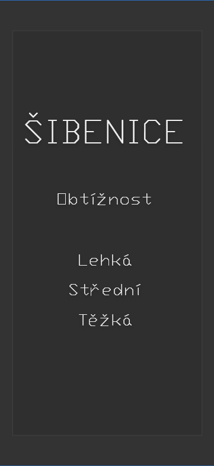

Zhruba 3 hodiny jsem strávil lámaním si hlavy nad tím co za aplikaci vytvořit. Co by bylo tak světoborného, že to ještě nikdy nikoho nenapadlo, a zároveň by to mohl vymyslet student 4. ročníku jako jsem já. Skrze pár nápadů jsem si uvědomil, jak moc komplikované některé aplikace vlastně jsou a že musím být realista. Rád bych vám tedy představil název mé, spíše než aplikace, hry.
# __ŠIBENICE__ #
Prověřte své znalosti! Máte všeobecný přehled? Vyzkoušejte zda otázkám dokážete čelit nebo vás takzvaně "_zabijou_".
## Pravidla hry ##
- Hra vám nabídne domovskou obrazovku, skrz kterou si lze vybrat typ obtížnosti (lehká, střední, těžka) dle typu obtížnosti se vám budou následně zobrazovat příslušné otázky.
- Po vybrání typu obtížnosti, se vám v horní části zobrazí otázka a pod ní příslušný počet políček pro doplnění písmen.
- Do políček lze doplňovat písmena.
- Při doplňování pouze správných písmen (v případě, že víme rovnou celé slovo) i slov, se výsledná tajenka zobrazí na zeleném pozadí a zobrazí se vám tlačítko "__DALŠÍ__", kterým se vám vygeneruje nová otázka.
- Při špatném doplnění písmene se však začne kreslit obrys oběšence. Nejprve __kopec__, poté __stožár__, poté __rameno__, poté __hák__, poté __smyčka__ a nakonec samotný __oběšenec__. Znamená to tedy, že máte 5 životů.
- V ten moment se na červeném pozadí zobrazí výsledná tajenka a stisknutím tlačítka "__NOVÝ__" se vám spustí nová otázka.
### Doplňující pravidla ###
- Pokud máte již nakreslený například __kopec__ a __rameno__ ale slovo následně uhádnete, tak se vám váš obrys nenuluje, ale přenáší se k další otázce.
## Funkce ##
- Menu - výběr obtížnosti.
- Ze hry se lze pomocí šipky vrátit do menu a změnit typ obtížnosti.
- Tlačítkem "__NOVÝ__" lze vynulovat postup a vygenerovat novou otázku.
- Otázky nelze přeskakovat.

- __Úvodní obrazovka__ - _vybereme typ obtížnosti: lehké_

- __Hrací pole__ - _hádáme jméno, typujeme různá písmena a už jsme se dvakrát mýlili, proto máme obrys (__kopce__ a __ramene__)_
